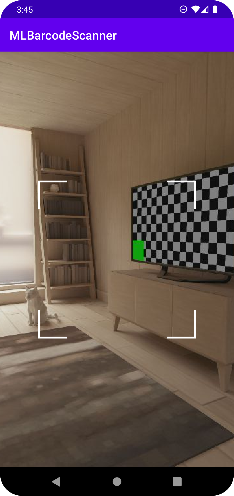

# MLBarcodeScanner
A demo project to show how to implement barcode scanner using Google ML-Kit Vision api



# Supported barcode types
- **2D formats**: QR Code, Aztec, Data Matrix, PDF417
- **Linear formats**: Codabar, Code 39, Code 93, Code 128, EAN-8, EAN-13, EAN-128, ITF, UPC-A, UPC-E

# Usage
There are two types of dependency for barcode scanning using ML-Kit vision

## Bundled model 
(with 3-10 MB increase in apk size) 

Use this dependency
```groovy
implementation 'com.google.mlkit:barcode-scanning:17.0.2'
```

## Unbundled
(with no increase in apk size but downloaded from Google Play Services on demand)

Use this dependency
```groovy
implementation 'com.google.android.gms:play-services-mlkit-barcode-scanning:17.0.0'
```

Also you can optimize it to download models immediately after installing from **Play Store** 
by adding this meta-data to your `AndroidManifest.xml` 
```xml
<meta-data
    android:name="com.google.mlkit.vision.DEPENDENCIES"
    android:value="barcode" />
```

# Reference
- https://developers.google.com/ml-kit/vision/barcode-scanning/android