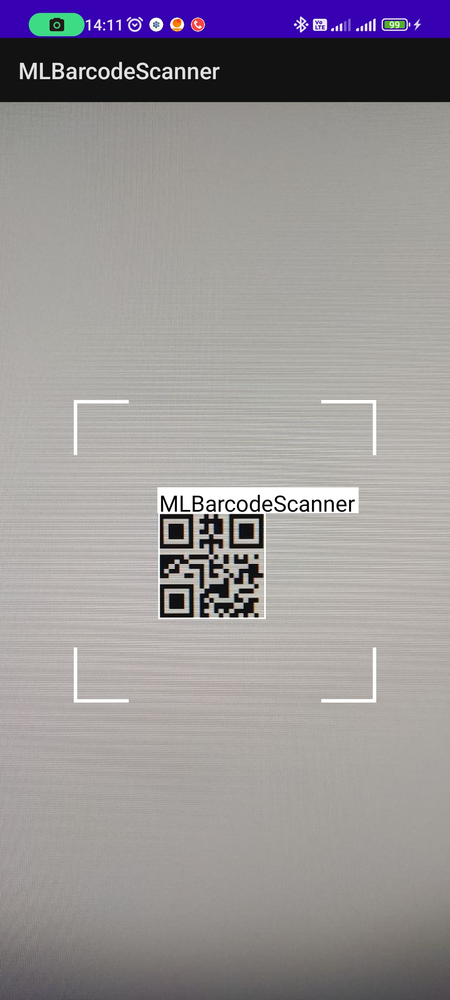

[](https://jitpack.io/#javaherisaber/MLBarcodeScanner)
# MLBarcodeScanner
Android barcode scanner using Google ML-Kit Vision



# Usage
## Dependency
Top level build.gradle
```groovy
allprojects {
   repositories {
       maven { url 'https://jitpack.io' }
       // other repositories
  }
}
```

Module level build.gradle
```groovy
dependencies {
  implementation "com.github.javaherisaber:MLBarcodeScanner:1.0.0"
}
```

Create your layout
```xml
<androidx.constraintlayout.widget.ConstraintLayout android:layout_height="match_parent"
    android:layout_width="match_parent"
    xmlns:android="http://schemas.android.com/apk/res/android"
    xmlns:app="http://schemas.android.com/apk/res-auto"
    xmlns:tools="http://schemas.android.com/tools">

    <androidx.camera.view.PreviewView
        android:id="@+id/previewView_cameraScanning"
        android:layout_height="0dp"
        android:layout_width="match_parent"
        app:layout_constraintTop_toTopOf="parent"
        app:layout_constraintBottom_toBottomOf="parent" />

    <com.buildtoapp.mlbarcodescanner.GraphicOverlay
        android:id="@+id/graphic_overlay"
        android:layout_height="0dp"
        android:layout_width="0dp"
        app:layout_constraintBottom_toBottomOf="@id/previewView_cameraScanning"
        app:layout_constraintLeft_toLeftOf="@id/previewView_cameraScanning"
        app:layout_constraintRight_toRightOf="@id/previewView_cameraScanning"
        app:layout_constraintTop_toTopOf="@id/previewView_cameraScanning" />

    <ImageView
        android:layout_height="264dp"
        android:layout_width="264dp"
        android:src="@drawable/ic_scan_area"
        app:layout_constraintBottom_toBottomOf="parent"
        app:layout_constraintEnd_toEndOf="parent"
        app:layout_constraintStart_toStartOf="parent"
        app:layout_constraintTop_toTopOf="parent"
        tools:ignore="ContentDescription" />

</androidx.constraintlayout.widget.ConstraintLayout>

```

Make sure to grant `android.permission.CAMERA` and then use the library
```kotlin
class MainActivity : AppCompatActivity() {
    private lateinit var binding: ActivityMainBinding
    private lateinit var barcodeScanner: MLBarcodeScanner

    override fun onCreate(savedInstanceState: Bundle?) {
        super.onCreate(savedInstanceState)
        binding = ActivityMainBinding.inflate(layoutInflater)
        setContentView(binding.root)

        if (!PermissionUtils.allRuntimePermissionsGranted(this, REQUIRED_RUNTIME_PERMISSIONS)) {
            PermissionUtils.getRuntimePermissions(this, REQUIRED_RUNTIME_PERMISSIONS)
        }
        initBarcodeScanner()
    }

    private fun initBarcodeScanner() {
        barcodeScanner = MLBarcodeScanner(
            callback = { displayValue, rawValue ->
                // you can process your barcode here
            },
            focusBoxSize = MetricUtils.dpToPx(264),
            graphicOverlay = binding.graphicOverlay,
            previewView = binding.previewViewCameraScanning,
            lifecycleOwner = this,
            context = this,
            drawOverlay = true, // show rectangle around detected barcode
            drawBanner = true // show detected barcode value on top of it
        )
    }

    companion object {
        private val REQUIRED_RUNTIME_PERMISSIONS = arrayOf(Manifest.permission.CAMERA)
    }
}
```

# Supported barcode types
- **2D formats**: QR Code, Aztec, Data Matrix, PDF417
- **Linear formats**: Codabar, Code 39, Code 93, Code 128, EAN-8, EAN-13, EAN-128, ITF, UPC-A, UPC-E

# Model types
There are two types of dependency for barcode scanning using ML-Kit vision

## Bundled model 
(with 3-10 MB increase in apk size) 

Use this dependency
```groovy
implementation 'com.google.mlkit:barcode-scanning:17.0.2'
```

## Unbundled
(with no increase in apk size but downloaded from Google Play Services on demand)

Use this dependency
```groovy
implementation 'com.google.android.gms:play-services-mlkit-barcode-scanning:17.0.0'
```

Also you can optimize it to download models immediately after installing from **Play Store** 
by adding this meta-data to your `AndroidManifest.xml` 
```xml
<meta-data
    android:name="com.google.mlkit.vision.DEPENDENCIES"
    android:value="barcode" />
```

# Reference
- https://developers.google.com/ml-kit/vision/barcode-scanning/android
- https://github.com/googlesamples/mlkit/tree/master/android/vision-quickstart
